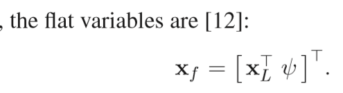

# 导读Aggressive Flight With Suspended Payloads Using Vision-Based Control

## 0.Abstract

本文使用下视摄像头观察并估计负载，实现了负载三维空间的闭环控制，规划，估计。能够实现负载最大垂直于地面53°的控制，首次实现了大角度悬挂负载的闭环敏捷策略

## 1.Introduction

过去的相关工作都通过限制运动维度，将三维运动压缩为二维（平面）进行的控制，完全依赖于外部运动捕捉系统和无人机的闭环控制而不是对负载的位置控制。

## 2.建模

假设负载为一质量点，绳子为无质量的棒

$\mathcal{I}$

系统动能和势能

$\mathcal{T}=\frac{1}{2}(m_Q+m_L)\mathbf{\dot{x_L}}\cdot\mathbf{\dot{x_L}}-m_Ql\mathbf{\dot{x_L}}\cdot\mathbf{\dot{p}}\\+\frac{1}{2} m_Ql^2\mathbf{\dot{p}}\cdot\mathbf{\dot{p}}+\frac{1}{2}\Omega\mathbb{I}\Omega$

虚拟功

偏差

Lagrange-d’Alembert型可积的微分方程

` K. Sreenath, T. Lee, and V. Kumar, “Geometric control and differential flatness of a quadrotor UAV with a cable-suspended load,” in Proc. IEEE Conf. Decis. Control, Dec. 2013, pp. 2269–2274. `

系统关键还是differentially flat，将状态和输入表示为一组变量（x,y,z,yaw)及其导数的非线性方程

`对负载也做于无人机相应的变量压缩处理，这里的yaw仍然是无人机的yaw，对负载的姿态可以忽略`

利用负载的状态反推无人机状态。论文中假设yaw是不变的，绳子一直都是拉紧的，即负载一直都是受无人机控制的

## 3.控制

重中之重：跟踪轨迹

$des$ 表示规划的轨迹

$c$ 表示控制器计算得到的控制指令

Differential flatness（微分平坦），保证了负载规划轨迹$\mathbf{X_{L,des}}$的任意六阶可以被映射到无人机的动力学状态$\mathbf{X_{des}}$和输入$\mathbf{u_{des}}$。因此轨迹的优化可以直接根据负载的期望状态进行，SectionV的内容

采用分层控制，如图

**期望负载轨迹**直接输入**负载位置控制器**获得**期望负载姿态和角速度**，**负载姿态控制器**结合实际姿态和角速度计算的**无人机期望姿态，角速度和升力**，**无人机姿态控制器**计算的最终输入**升力和力矩**

为了实现大角度摆动控制，因此无法进行线性化处理（小角度假设）或姿态参数化（奇异性）

**无人机姿态控制器**(P)

$c$ 表示控制器计算得到的控制指令

**负载姿态控制器**(PD)

$c_{1c}$ 计算的中间坐标系

**负载位置控制器**（PID)

## 4.负载估计

算法：ExtendedKalmanFilter(EKF),yielding high-frequency,dynamics-informedestimates

### A. Detector

开源的检测器

`T. Krajn´ık et al., “A practical multirobot localization system,” J. Intell. Robot. Syst., vol. 76, pp. 539–562, 2014`

黑白相间圆得到亚像素精度的像素位置

### B. 相机模型

获取负载到相机的单位向量**n^C**

### C. 绳长约束

得到负载相对于无人机的位置

### D. 基于模型的估计器

## 5. 轨迹规划 

核心思想于minimum snap相似，最小化$\mathbf{X_L^{(6)}}$，求解二次规划问题

代价函数

连续性约束

边界约束（始末点中间点位置约束）

这里考虑到规划出来的轨迹可能会导致绳子不是张紧的，因此需要对规划出的轨迹进行处理，通过对时间段乘上一个系数（应该是大于0的）来调整规划的路径保证无人机加速度不至于过大导致无法满足假设。

这里的$\frac{\mathbf{X_{L,des}^{(k)}}}{\alpha^k},\alpha = \alpha\tau,\tau=0,1$

经典佳作

` D. Mellinger and V. Kumar, “Minimum snap trajectory generation and control for quadrotors,” in Proc. 2011 IEEE Int. Conf. Robot. Autom., Shanghai, China, May 2011, pp. 2520–2525`