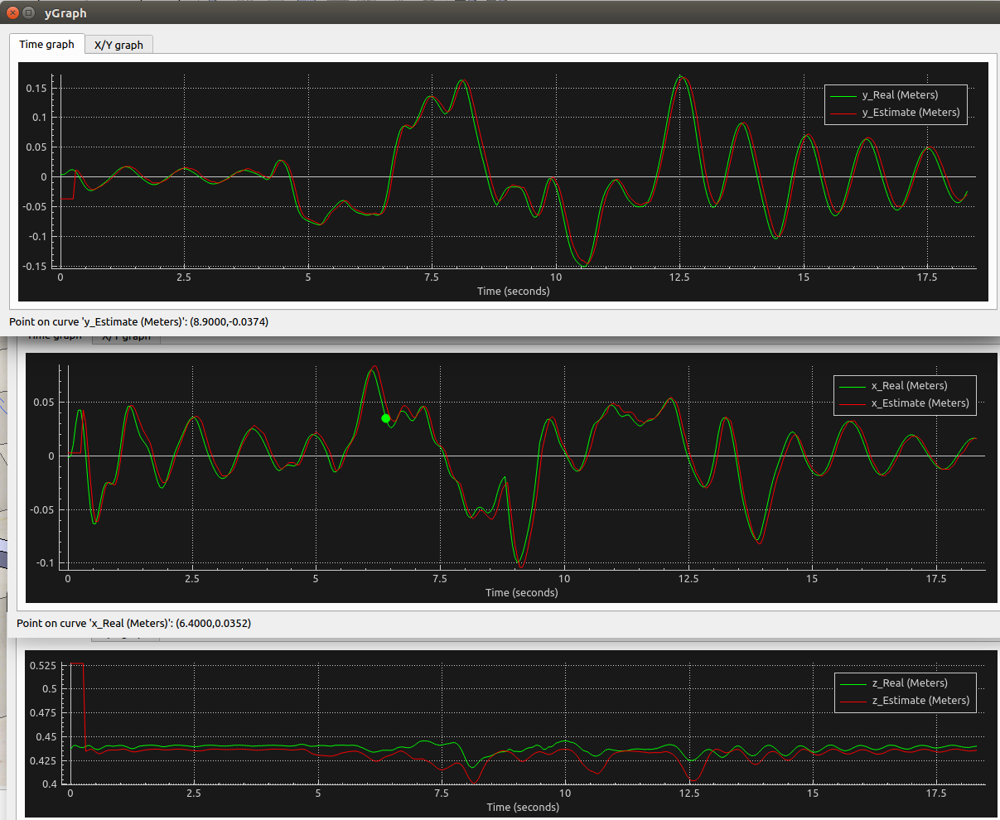
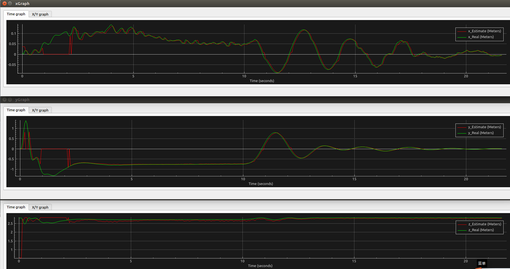
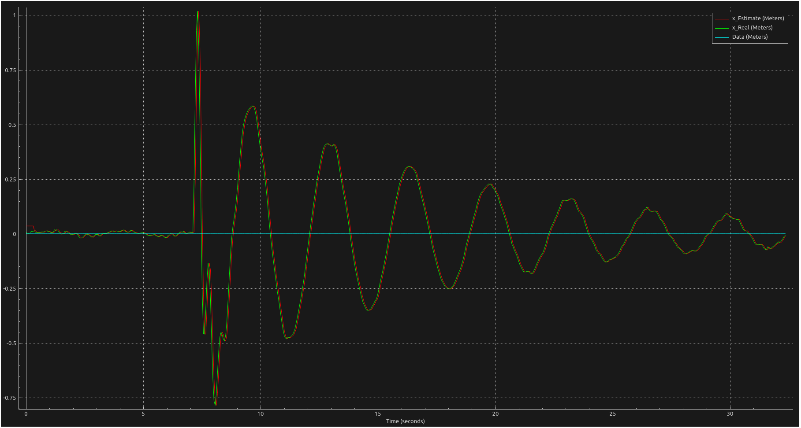
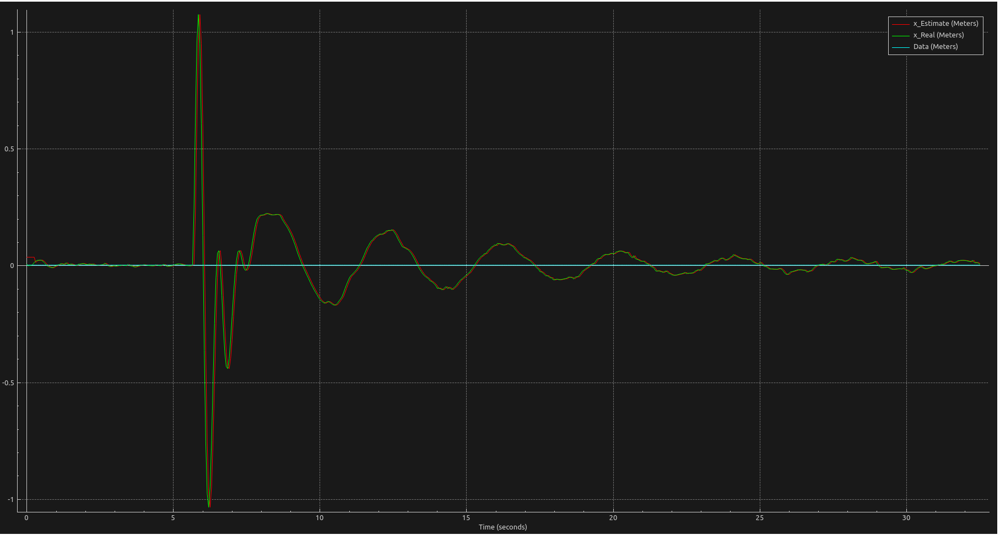
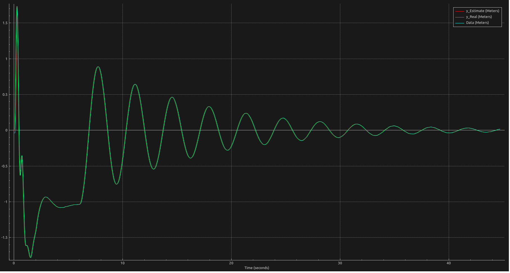
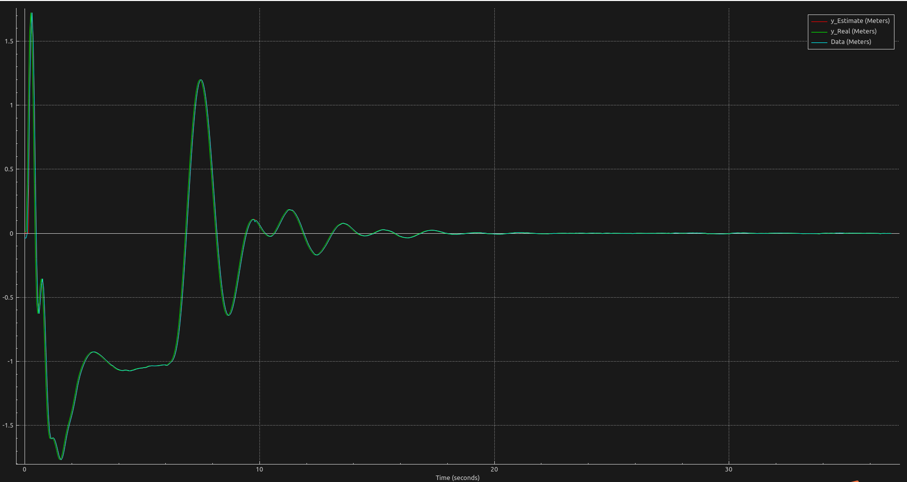

# 工作空间详情

```lua
├── quadcopter_ws
│   └── src
│       ├── apriltag_ros
│       │   ├── apriltag_ros
│       │   │   ├── launch
│       │   │   │   ├── detection_sim.launch --使用的apriltag检测节点
│       │   │   └── tagImages --存放二维码图片的文件夹
│       └── tracker
│           ├── launch
│           │   └── payloadTracker.launch --启用staple或Camshift跟踪的launch文件
│           └── src
│               ├── payloadControl_PrecisePos.cpp --最终控制的主程序
│               └── tracker.cpp --使用负载跟踪的视觉节点
├── Research.md --研究的相关整理资料
├── Resources --相关的资料
├── scenes --Coppeliasim场景
│   ├── quarter_PrecisePos.ttt --使用仿真反馈负载位置的控制场景
│   ├── quarter_Vision.ttt --最新使用apriltag进行控制的场景
└── videos 
```


# 使用方法

```bash
catkin_make_isolated
source devel_isolated/setup.zsh
roslaunch tracker controller_payload_apriltag.launch#启动apriltag做跟踪的
```


# TODO：

- 整理好框架
- 整理下文件
- 电位器测量负载向量配合视觉做卡尔曼滤波融合？


# 目标跟踪

## 1.算法：KCF

效果：

 [estimateQuadcopterLoad-2020-02-19_17.10.04.mkv](videos/estimateQuadcopterLoad-2020-02-19_17.10.04.mkv) 

## 2.Apriltag



 [quadcopterControllerApriltag-2020-04-13_22.38.53.mkv](videos/quadcopterControllerApriltag-2020-04-13_22.38.53.mkv) 

为了确保Apriltag能正确使用，请使用`catkin_make_isolated`进行编译

# 防摆控制算法

PD控制

https://www.zhihu.com/answer/330795289

想法将速度影响的比例增大，使得达到文章中与人相似的效果

TODO: 尝试结合位置差和速度拟合成一个输出


## 控制俯仰角和翻转角的PD控制

无控制

## 

有控制



## 控制升力F和力矩M的飞控控制法

无控制



 [payloadWithoutControl.mkv](videos/payloadWithoutControl.mkv) 

有控制



 [payloadControl_PID_PrecisePos.mkv](videos/payloadControl_PID_PrecisePos.mkv) 

## iLQR控制升力F和力矩M的控制
```

```