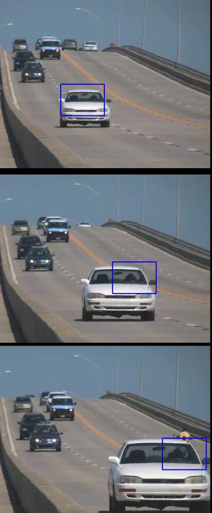
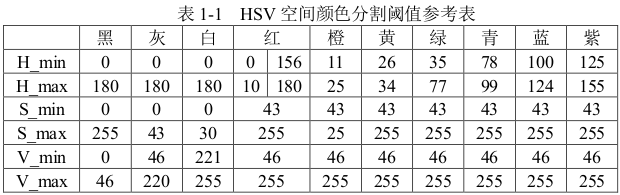
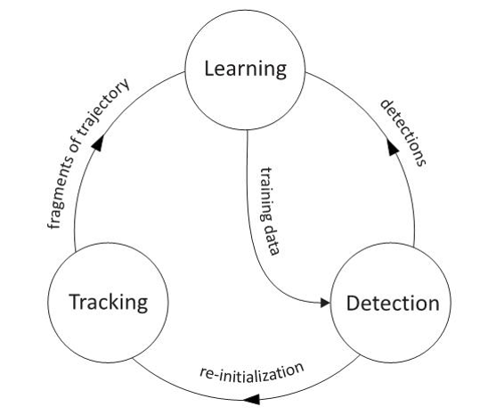
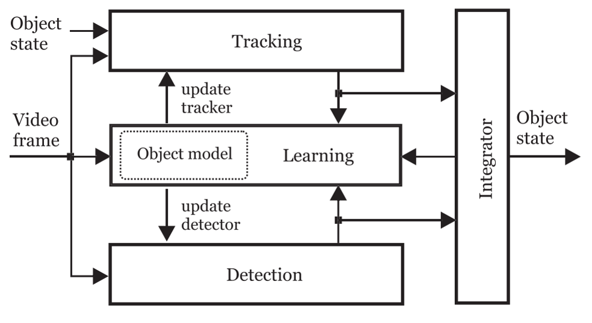
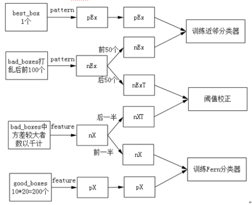
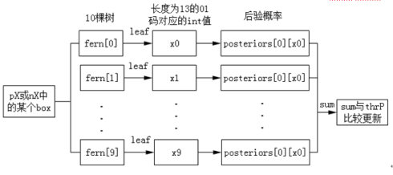
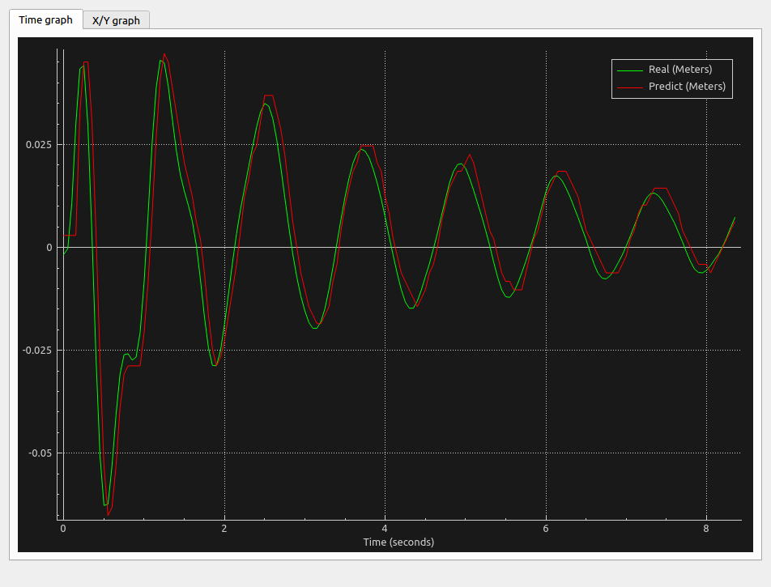
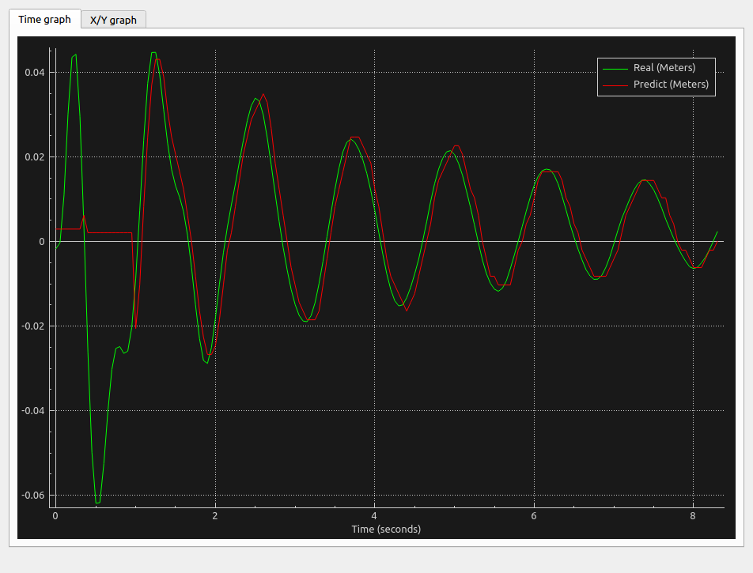
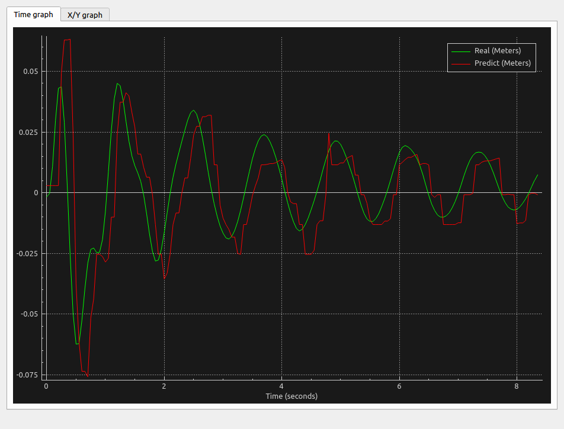
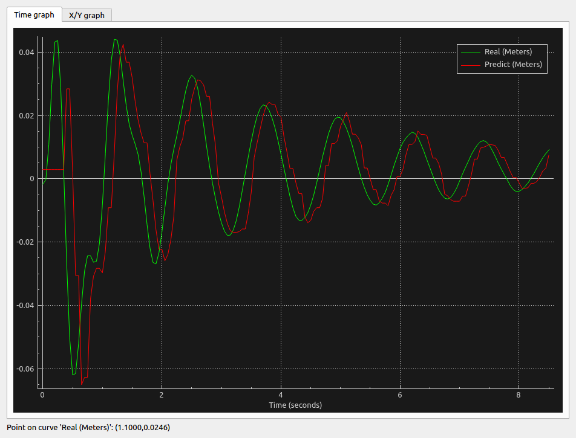

# 问题难点

## **1.长的绳子导致摆动很大**机身抖动大视角晃动大就不太行了

### 思路：

### 1.利用二维码？

### 2.扩大识别范围？

### 3.利用物理判别法？

环形压力传感器配合，圆弧判别角度？

~~IMU：误差过大~~


## **2.绳子越长，估计也越不准**

一个因素时建模不太准

另一个因素应该是像素点只能取整，他的精度和步长只有0.5个像素

### 思路：

### 1.分辨率越高应该就越好，但可能运行的更慢

### 2.先通过分辨率低的图片定位物体，获得roi，再对roi内图片合成高分辨率之类的，再通过计算矩之类的算出相对位置，然后按高低分辨率比感觉可以决定精度

上采样法：https://blog.csdn.net/robinhjwy/article/details/77619015

- 采样后图片模糊，特征不易采集

  [局部二值模式（LBP）、局部三值模式（LTP）]: https://www.cnblogs.com/lyxyhhxbk/p/10816863.html

  Canny边缘检测

- 上采样xy像素x64结果：16fps

  

- 无像素优化：118fps

  


# 技术研究

# 目标跟踪

## 1. 聚类算法

### 1.1 Meanshift

https://docs.opencv.org/master/d7/d00/tutorial_meanshift.html

https://blog.csdn.net/dcrmg/article/details/52771372

均值移位背后的直觉很简单。考虑一下你有几点。（它可以是像素分布，例如直方图反投影）。您会得到一个小窗口（可能是一个圆形），并且必须将该窗口移到最大像素密度（或最大点数）的区域。如下图所示：


初始窗口以蓝色圆圈显示，名称为“ C1”。其原始中心以蓝色矩形标记，名称为“ C1_o”。但是，如果您找到该窗口内点的质心，则会得到点“ C1_r”（标记为蓝色小圆圈），它是窗口的真实质心。当然，它们不匹配。因此，移动窗口，使新窗口的圆与上一个质心匹配。再次找到新的质心。很可能不会匹配。因此，再次移动它，并继续迭代，以使窗口的中心及其质心落在同一位置（或在很小的期望误差内）。因此，最终您获得的是一个具有最大像素分布的窗口。它带有一个绿色圆圈，名为“ C2”。正如您在图像中看到的，它具有最大的点数。


因此，我们通常会传递直方图反投影图像和初始目标位置。当对象移动时，显然该移动会反映在直方图反投影图像中。结果，meanshift算法将我们的窗口以最大密度移动到新位置。



### 1.2 Camshift

您是否密切关注了最后结果？这儿存在一个问题。无论汽车离相机很近或非常近，我们的窗口始终具有相同的大小。这是不好的。我们需要根据目标的大小和旋转来调整窗口大小。该解决方案再次来自“ OpenCV Labs”，它被称为Gary布拉德斯基（Gary Bradsky）在其1998年的论文“用于感知用户界面中的计算机视觉面部跟踪”中发表的CAMshift（连续自适应均值偏移）[[27\]](https://docs.opencv.org/master/d0/de3/citelist.html#CITEREF_Bradski98)。

它首先应用均值移位。一旦均值收敛，它将更新窗口的大小，即

$s = 2 * \sqrt{M_{00}/256}$

它还可以计算出最合适的椭圆的方向。再次将均值偏移应用于新的缩放搜索窗口和先前的窗口位置。该过程一直持续到达到要求的精度为止。


#### OpenCV下使用方法

opencv网站有源码，有需要可参考

封装函数

```cpp
CamShift( InputArray probImage, CV_OUT CV_IN_OUT Rect& window, TermCriteria criteria );
```

第一个参数probImage是反向投影图像

第二个参数window是输入和输出的搜索窗口/目标窗口，window的尺寸会自动调整

第三个参数criteria是迭代收敛终止条件

```cpp
#include "core/core.hpp"      
#include "highgui/highgui.hpp"      
#include "imgproc/imgproc.hpp"  
#include "video/tracking.hpp"  
#include<iostream>      
 
using namespace cv;      
using namespace std;      
 
Mat image;    
Mat rectImage;  
Mat imageCopy; //绘制矩形框时用来拷贝原图的图像    
bool leftButtonDownFlag=false; //左键单击后视频暂停播放的标志位    
Point originalPoint; //矩形框起点    
Point processPoint; //矩形框终点    
 
Mat targetImageHSV;  
int histSize=200;    
float histR[]={0,255};    
const float *histRange=histR;    
int channels[]={0,1};   
Mat dstHist;  
Rect rect;  
vector<Point> pt; //保存目标轨迹  
void onMouse(int event,int x,int y,int flags ,void* ustc); //鼠标回调函数    
 
int main(int argc,char*argv[])      
{      
	VideoCapture video(argv[1]);    
	double fps=video.get(CV_CAP_PROP_FPS); //获取视频帧率    
	double pauseTime=1000/fps; //两幅画面中间间隔    
	namedWindow("跟踪木头人",0);      
	setMouseCallback("跟踪木头人",onMouse);    
	while(true)    
	{    
		if(!leftButtonDownFlag) //判定鼠标左键没有按下，采取播放视频，否则暂停    
		{    
			video>>image;    
		}    
		if(!image.data||waitKey(pauseTime)==27)  //图像为空或Esc键按下退出播放    
		{    
			break;    
		}   
		if(originalPoint!=processPoint&&!leftButtonDownFlag)    
		{   
			Mat imageHSV;  
			Mat calcBackImage;  
			cvtColor(image,imageHSV,CV_RGB2HSV);  
			calcBackProject(&imageHSV,2,channels,dstHist,calcBackImage,&histRange);  //反向投影  
			TermCriteria criteria(TermCriteria::MAX_ITER + TermCriteria::EPS, 1000, 0.001);    
			CamShift(calcBackImage, rect, criteria);     
			Mat imageROI=imageHSV(rect);   //更新模板             
			targetImageHSV=imageHSV(rect);  
			calcHist(&imageROI, 2, channels, Mat(), dstHist, 1, &histSize, &histRange);    
			normalize(dstHist, dstHist, 0.0, 1.0, NORM_MINMAX);   //归一化  
			rectangle(image, rect, Scalar(255, 0, 0),3);    //目标绘制    
			pt.push_back(Point(rect.x+rect.width/2,rect.y+rect.height/2));  
			for(int i=0;i<pt.size()-1;i++)  
			{  
				line(image,pt[i],pt[i+1],Scalar(0,255,0),2.5);  
			}  
		}    
		imshow("跟踪木头人",image);   
		waitKey(100);  
	}  
	return 0;    
}      
 
//*******************************************************************//      
//鼠标回调函数      
void onMouse(int event,int x,int y,int flags,void *ustc)      
{     
	if(event==CV_EVENT_LBUTTONDOWN)      
	{      
		leftButtonDownFlag=true; //标志位    
		originalPoint=Point(x,y);  //设置左键按下点的矩形起点    
		processPoint=originalPoint;    
	}      
	if(event==CV_EVENT_MOUSEMOVE&&leftButtonDownFlag)      
	{      
		imageCopy=image.clone();    
		processPoint=Point(x,y);    
		if(originalPoint!=processPoint)    
		{    
			//在复制的图像上绘制矩形    
			rectangle(imageCopy,originalPoint,processPoint,Scalar(255,0,0),2);    
		}    
		imshow("跟踪木头人",imageCopy);    
	}      
	if(event==CV_EVENT_LBUTTONUP)      
	{      
		leftButtonDownFlag=false;    
		rect=Rect(originalPoint,processPoint);        
		rectImage=image(rect); //子图像显示    
		imshow("Sub Image",rectImage);        
		cvtColor(rectImage,targetImageHSV,CV_RGB2HSV);  
		imshow("targetImageHSV",targetImageHSV);  
		calcHist(&targetImageHSV,2,channels,Mat(),dstHist,1,&histSize,&histRange,true,false);         
		normalize(dstHist,dstHist,0,255,CV_MINMAX);  
		imshow("dstHist",dstHist);  
	}        
}     
```


## 2. 颜色处理

OpenCV下HSV空间



## 3. TLD(Tracking-Learning-Detection)

TLD是一个用于针对视频中未知物体长期跟踪的架构。简单来说，TLD算法由三部分组成：跟踪模块、检测模块、学习模块。跟踪模块是观察帧与帧之间的目标的动向。检测模块是把每张图看成独立的，然后去定位。学习模块将根据跟踪模块的结果对检测模块的错误进行评估，生成训练样本来对检测模块的目标模型进行更新，避免以后出现类似错误。

https://www.cnblogs.com/huty/p/8519325.html



TLD跟踪系统最大的特点就在于能对锁定的目标进行不断的学习，以获取目标最新的外观特征，从而及时完善跟踪，以达到最佳的状态。也就是说，开始时只提供一帧静止的目标图像，但随着目标的不断运动，系统能持续不断地进行探测，获知目标在角度、距离、景深等方面的改变，并实时识别，经过一段时间的学习之后，目标就再也无法躲过。

TLD技术采用跟踪和检测相结合的策略，是一种自适应的、可靠的跟踪技术。TLD技术中，跟踪器和检测器并行运行，二者所产生的结果都参与学习过程，学习后的模型又反作用于跟踪器和检测器，对其进行实时更新，从而保证了即使在目标外观发生变化的情况下，也能够被持续跟踪。


## TLD算法实现

https://www.cnblogs.com/huty/p/8519325.html




### 1. detector 检测器的实现

检测器包括三个：一是方差检测器；二是随机深林；三是最近邻分类器；

step1 首先，输入一幅图，人工指定目标矩形框，然后通过在整幅图上进行扫面窗口得到一堆图像patch。

**扫描窗口的实现：**设定了21个尺度，在选定的目标矩形框大小基础上，向上梯度10个，向下梯度10个。尺度梯度为1.2，每个梯度下都进行窗口扫描，步进为窗口大小（宽度和高度都是10%）的10%，获取按照设定的扫描方式扫描得到整幅图像的patch。当然大小也有限制，最小窗口尺寸为15x15。

step 2 从patch中得到用于训练和测试的随机深林和最近邻分类器的样本。

选择的标准是从patch与目标矩形框的重叠度overleap，重叠度越大，越认为是正样本，重叠度越小就认为是负样本。具体的正样本和负样本见下图：




对于最近邻分类器，正样本只有一个就是best_box，即我们认为选定的或者是TLD输出的上一帧最好的结果。

step 3  方差分类器

利用平方积分图IIimage和积分图Iimage可快速计算任意patch的方差：var（patch） =  IIimage（patch）- Iimage（patch）x Iimage（patch）。方差小于best_box的方差50%的patch就直接淘汰。只有通过方差分类器的才能进入随机森林

step 4  随机深林的训练和测试




这是随机深林的训练过程和测试过程：随机深林的大小为10棵树，树的大小为13个节点，每个节点都是一个基于像素比较的decisionstump。Decisionstump就是一个阈值切割，大于则为1，小于则为0；

Decisionstump的构造是随机的选取输入patch中的两点位置上的像素值进行比较，每棵树之间的decisionstump选取的点是随机的，同一颗树上的decisionstump也是随机的，所以称之为随机深林。但是，在随机深林初始化后，forest的结构也就固定了，每次通过随机深林时所对应的node节点上的decision stump是固定的，即每一帧上对应的同一棵树上的同一个节点所代表的像素比较点的位置是固定的，因此才能进行后验概率的学习。

首先是将通过方差检测的图像patch，分别输入10棵树上，树的每个节点上进行一个特征的decisionstump切割，最后每棵树的输出为一个13位的二进制编码.

利用采集到的正样本和负样本对decisiontree的输出二进制值的后验概率进行学习：P(y|X)=pN/(pN+nN)，有了这个我们就可以进行决策：10棵树的P之和与设定的阈值相比较就可以进行决策。而学习的过程就类似一个perception，犯错了才进P值的调整(犯了漏检则增加pN，犯了误检则增加nN)。


| y    | 0    | 0    | ……   | 0.7    | 1      |
| ---- | ---- | ---- | ---- | ------ | ------ |
| X    | 0    | 1    | ……   | 2^13-2 | 2^13-1 |


比如，输入的样本为（X，1），但是却小于阈值，被判定为负样本，则说明对应的P太小，需要提高，因此对P（1|X）进行增大。

测试过程：

利用测试集输入到训练好的随机深林中进行测试，主要是用来调整阈值。测试集都是负样本，从而统计负样本在随机深林上的得分，取得分最高的作为阈值。（这样所有的负样本基本上是不可能通过随机深林的）

step 5  最近邻分类器的训练和测试


最近邻分类器实际上就是在线的模板匹配，将输入的图像patch，通过仿射变换转变为15*15的patch，并进行0均值化，然后与在线的正样本模板和负样本模板进行匹配，计算对应的相关相似度和保守相似度。

最近邻分类器训练

最近邻分类器的训练过程其实就是更新在线模板的过程，如果输入的patch为正样本，但与在线的正、负模板pEx、nEx的相关相似度小于阈值，则分类错误，就将该输入的patch放入在线正模板pEx中。如果输入的patch为负样本，但与在线的正、负样本相关相似度大于阈值，则分类错误，就将该输入的patch放入负样本模板nEx中。效果就是动态地更新了在线模板

最近邻分类器测试

最近邻分类器的测试过程实际上跟随机深林的测试过程一样，为了调增对应的阈值，测试集全部是负样本，选取负样本中得到相关相似度最高的值作为最近邻分类器的分类阈值。


### 2. 中值流跟踪器的实现


TLD算法的跟踪模块（Tracker），是一种在名为中值流跟踪（Median-Flow tracker）的跟踪方法基础上增加了跟踪失败检测算法的新的跟踪方法。中值流跟踪方法利用目标框来表示被跟踪目标，并在连续的相邻视频帧之间估计目标的运动。

在TLD算法中，原作者将10*10的格子中的像素点作为初始特征点，并利用金字塔LK光流法来在连续的相邻视频帧之间估计若干特征点的运动。

跟踪模块的跟踪失败检测算法：

中值流跟踪算法的前提假设是目标是可见的，所以当目标完全被遮挡或者消失于视野，则不可避免地出现跟踪失败。为了能够解决这些问题，我们采用如下策略:

   让di表示其中某一个点的移动位移，  dm表示位移中值，则残差可定义为  |di-dm|。如果残差大于10个像素，那么就认为跟踪失败。这个策略能够很稳定地就确定出由剧烈移动或者遮挡所造成的跟踪失败。


•通过前向L-K金字塔光流法得到当前帧中与上一帧对应的特征点points2。

•利用points2通过反向L-K金字塔光流法得到上一帧对应的特征点FB_Points

•计算相似度similarity和错误匹配度FB_error

获取points1和points2的10x10亚像素精度区域，并进行像素匹配，得到匹配度作为相似度的衡量。通过计算points1和FB_points之间的距离，并归一化，作为错误匹配度的衡量。

•经过两步筛选，得到保留下的特征点

剔除50%相似度小的和50%错误匹配度大的特征点


### 3. 综合器的实现

综合器（Integrator）把检测器和跟踪器得到的目标框予以综合，并作为TLD最后的输出。如果跟踪器或者检测器都没有得到目标框，那么就认定当前帧中被跟踪目标没有出现的，否则，综合器将具有最大保守相似度的图像片作为最终的目标框所在位置。 


1）先通过 重叠度 对检测器检测到的目标boundingbox进行聚类，每个类的重叠度小于0.5：clusterConf(dbb,dconf, cbb, cconf);
（2）再找到与跟踪器跟踪到的box距离比较远的类（检测器检测到的box），而且它的相关相似度比跟踪器的要大：记录满足上述条件，也就是可信度比较高的目标box的个数：if(bbOverlap(tbb, cbb[i])<0.5 && cconf[i]>tconf)confident_detections++;
（3）判断如果只有一个满足上述条件的box，那么就用这个目标box来重新初始化跟踪器（也就是用检测器的结果去纠正跟踪器）：if(confident_detections==1) bbnext=cbb[didx];
（4）如果满足上述条件的box不只一个，那么就找到检测器检测到的box与跟踪器预测到的box距离很近（重叠度大于0.7）的所以box，对其坐标和大小进行累加：
if(bbOverlap(tbb,dbb[i])>0.7)cx += dbb[i].x;……
（5）对与跟踪器预测到的box距离很近的box和跟踪器本身预测到的box进行坐标与大小的平均作为最终的目标boundingbox，但是跟踪器的权值较大：
bbnext.x= cvRound((float)(10*tbb.x+cx)/(float)(10+close_detections));……
（6）另外，如果跟踪器没有跟踪到目标，但是检测器检测到了一些可能的目标box，那么同样对其进行聚类，但只是简单的将聚类的cbb[0]作为新的跟踪目标box

### 4. 学习模块的实现


Learning实际上就是重新组织正负样本对随机森林和最近邻分类器进行训练。训练的方式跟上面讲解的一样。

什么时候重新组织训练呢？实际上只对有跟踪结果参与的目标输出进行训练。

对新得到的当前帧的TLD目标输出box进行最近邻的检测，得到与在线模型的正负模板的相关相似度，如果相关相似度比较小，或者方差比较小，或者已经在在线模型中了，就不用训练学习了。否则就在该输出的位置进行类似初始化时候的训练一样，随机深林的后验概率和最近邻分类器的在线模板进行更新。当然就没有了像初始训练中的将数据集拆分为训练集和测试集的过程了。

## 仿真中的效果

**camshift：**

**KCF**

**TLD**

**自行尝试优化的TLD**

结论：TLD可能效率仍不够高，存在滞后性

​			KCF帧率较高，滞后性不明显，但对于丢失的目标无法很好的找回，鲁棒性较差

# 负载稳定

## 1. 欧拉-拉格朗日方程

https://zhuanlan.zhihu.com/p/45912984