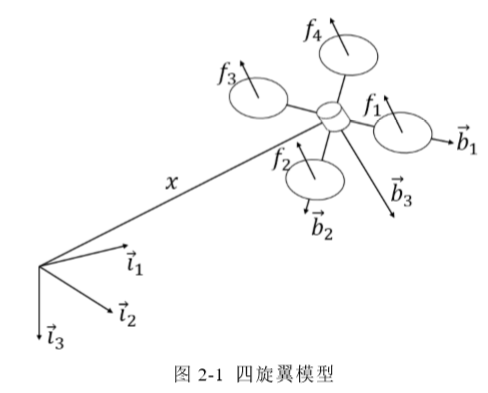
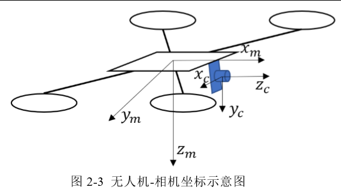

# 带悬绳负载的无人机视觉跟踪控制研究

**关键词**：无人机-悬挂物控制器；相机-悬挂物模型；视觉追踪控制器；无人机 运输 

# 1.摘要

- **目标**

  - 需要无人机可以**控制无人机自身不受悬挂负载的摆动的影响并且可以主动调整无人机自身的姿 态使得悬挂负载的摆动快速减小然后需要使得无人机-悬挂物系统在稳定飞行的情况下对运输的目的地进行长期有效的跟踪。** 

- **方法**：

  - 欧拉-拉格朗日方程建立了无人机-悬挂物的联合动力学模型，并应用该模型设计了无人机-悬挂物姿态控制器
  - 使用竖直向下的摄像头实时观 测悬挂物，并使用融合卡尔曼滤波的**CamShift跟踪算法**对悬挂物进行实时跟踪
  - 建立了相机-悬挂物几何模型，将 CamShift 算法跟踪得到的二维图像坐标转化 为悬挂物相对于无人机的三维物理坐标
  - 设计了基于 **TLD** 的视觉跟踪控制器，利用 TLD 算法得到的目标信息作为参考输入，进而控制无人机飞行，实现跟踪运载物体
  - 由于悬挂负载 会对无人机的控制产生严重干扰，因此本文在**视觉伺服控制器**的基础上，结合无人机-悬挂负载动力学模型，设计了无人机-悬挂物飞行控制器，其中包括无人机和悬挂负载的位置控制环、悬挂负载的姿态控制环及无人机的姿态控制环三部分

- **研究步骤**

  在基于 Gazebo 仿真的基础上对整个系统进行了真实场景下的实验搭建了硬件平台在运动捕捉系统下进行了无人机-悬挂物控制器以及视觉追踪控制器的实验，分别验证了无人机-悬挂物 的飞行控制以及无人机-悬挂物系统视觉追踪控制器的飞行控制。

# 2.结论

- **已完成工作**

  1. 针对无人机-悬挂物模型进行了动力学建模，推导出无人机-悬挂物的动 力学模型
  2. 设计无人机-悬挂物姿态控制器，包括设 计了无人机-悬挂物位置控制环，速度控制环以及姿态控制环。通过实验证明无 人机-悬挂物姿态控制器可以快速减小悬挂物的摆动，实现无人机-悬挂物系统 的稳定飞行
  3. 使用 TLD 跟踪算法设计无人机视觉跟踪控制器，并通过实验证明了该 控制器在长期跟踪时的实时性和稳定性。 
  4. 对相机-悬挂物几何模型进行了建模，该模型型可以将图像平面二维信息 换算成悬挂物三维坐标信息。通过实验验证了模型的准确性，使用融合 Kalman 滤波的 CamShift 算法对悬挂物的位置进行追踪，通过实验**验证了利用模型计算 出的悬挂物实时位置与悬挂物真实位置几乎重合**。
  5. 融合无人机视觉跟踪控制器以及无人机-悬挂物姿态控制器实现了无人机 -悬挂物运输任务的综合控制器，**将视觉跟踪控制器作为前端算法，将其计算得 到的目标位置传给无人机-悬挂物姿态控制器对无人机-悬挂物飞行姿态进行控制 **

- **待完善**

  - 不能实现自己定位和姿态控制
  - 在室内进行，虽然悬挂物的控制已经可以通过视觉实 现，但是无人机自身的位置姿态还需要室内的运动捕捉系统提供，因此未来可 以将用于无人机自身定位的惯性视觉里程计融入到整个系统当中，使得整个系 统可以完全脱离运动捕捉系统并且在室内室外都可以很好的完成任务。
  - 算法基于颜色处理，受外界环境影响大
    - 本文在跟踪悬挂物实时位置时使用的是融合 Kalman 滤波的改进的 CamShift 算法，该算法虽然实时性和鲁棒性都还不错，但是由于该算法是基于 颜色的，对场景有一定的要求
  - 模型推导不精确
    - 本文的相机-悬挂物模型由于是近似推导的，因此在实验部分可以看到通 过模型估计得到的向量和真实向量还是有微小偏差，虽然不影响对悬挂物的控制，但是未来的工作也可以通过精确的建立相机-悬挂物的模型来完善对悬挂物 的控制。

# 3.绪论

- 应用

  快递物流

- 无人机悬挂研究现状

  - 浙大：可保证无人机控制，无法控制悬挂物
  - 哈工大： 
    - 贾二平. 基于视觉伺服的无人机悬挂负载控制研究[D]. 哈尔滨工业大学, 2016. 
    -  李婷. 基于强化学习的无人机悬挂负载系统控制研究[D]. 哈尔滨工业大 学, 2016 
  -  将直升机负载系统的非线 性动力学方程在悬停处线性化，由此产生的线性模型用于设计跟踪直升机的位 置的线性二次型（LQR）控制器
    - Omar H M. New Fuzzy-based Anti-Swing Controller for Helicopter Slung-Load System Near Hover[C]//IEEE International Symposium on Computational Intelligence in Robotics and Automation. IEEE, 2009:474-479. 
  - I. Palunko 于 2012 年又提出了一 种用动态规划生成最优的运动轨迹的方法，同时设计了一个自适应控制器， 解决了上述无人机重心变动的问题，并证明了该自适应控制器能够准确地跟踪 多旋翼无人机的位置和姿态。但是该方法需要提前规划好搬运轨迹，不能达到 实时搬运的目的
  - Alothman Y 等人[26]在 2015 年针对四旋翼无人机-悬挂负载系统的搬运提 出了一种线性二次型调节器（LQR）的控制方法。当无人机处于悬停时，在悬 停点将无人机-悬挂负载系统的非线性动力学模型线性化。并和 PD 控制器比较， 证明了其收敛速度。但是该方法只能在无人机处于悬停状态下使用
    -  Alothman Y, Jasim W, Gu D. Quad-rotor Lifting-Transporting Cable-Suspended Payloads Control[C]//International Conference on Automation and Computing. IEEE, 2015:1-6. 
  - Aleksandra Faust 等人[29]通过强化学习的方法生成悬挂负载的运动轨迹。为 确保悬挂负载跟踪规划的参考轨迹，无人机需要学习自身运动轨迹。这个方法 基于最小二乘迭代策略，是强化学习方法的一种。采用此方法的主要优点是不 需要建立系统的模型，所以该方法较适合对模型复杂、难以建模的控制系统， 并且该方法对噪声的影响更具鲁棒性，但是需要对特定的负载进行训练，而且 不能够实时规划运动轨迹
  - Taeyoung Lee[30]等人对多架无人机连接负载进行了动力学建模，并且设计 了几何 PID 控制器，该控制器可以对负载的位置和姿态同时进行控制
  - Foehn P[31]等人提出了一种新的无人机-悬挂物建模方法，将其建模为一个 软体链接与两个转动副和一个移动关节的组合。此模型在设计无人机-悬挂物控 制器时不需要考虑绳子上的张力大小。Foehn P 还提出一种快速轨迹优化技术， 将悬挂物的摆动轨迹问题转化为一个带互补约束的数学规划问题。通过实验证 明，该方法在计算速度和轨迹优化方面都有更优秀的表现。 
    -  Foehn P, Falanga D, Kuppuswamy N, et al. Fast Trajectory Optimization for Agile Quadrotor Maneuvers with a Cable-Suspended Payload[C]//Robotics: Science and Systems. 2017: 1-10.  

- 无人机视觉研究现状

  针对视觉跟踪算法，主要分为两大类：**生成[32]（generative）模型方法和判 别[33]（discriminative）模型方法**，目前主要流行的是判别类方法，也就是检测 跟踪（tracking-by-detection）。生成类算法就是对现有帧进行目标建模，在下帧 寻找与目标模型最相似区域，也就是目标预测，比较著名算法有卡尔曼滤[34]、 粒子滤波[35]、mean-shift[36]等。判别类算法主要是使用图像特征结合机器学习的 方式，以目标区域为正样本，背景区域为负样本，并以此结合机器学习训练分 类器，在下一帧使用这一帧的分类器，比较经典的有 Struck[37]和 TLD[38]。还有 基于相关滤波和深度学习的视觉跟踪算法也发展的十分迅速

  - 中国科学院的赵晓光[45]提出了一种基于视觉伺服的小型无人直升机地面移 动目标跟踪控制系统。建立了无人直升机的速度动力学模型，根据模型和移动 目标的图像信息，设计了无人直升机的视觉伺服控制系统，实现了对地面移动 目标的跟踪，并在运动目标进行简单运动（如直线运动）和复杂运动（如 S 形 运动）等情况下验证了该方法的有效性。
    -  赵晓光. 基于视觉的小型无人直升机跟踪地面目标方法研究[C]//中国科 学 院博士后学术年会暨高新技术前沿与发展学术会议程序册. 2010
  - 南京航天航空大学的张天翼等人提出一种自适应控制无人机跟踪控制方法。采用单目和双目结合的方式，单目用于跟踪目标，采用 Kalman 预测优化 的自适应算法对目标进行长期有效的跟踪。该方法在跟踪的基础上结合了双目， 对无人机避障进行了研究，使得在跟踪的过程中可以及时的躲避障碍。并在仿 真中验证了该方法的正确性。 
    -  张天翼. 基于连续自适应均值漂移和立体视觉的无人机目标跟踪方法[D]. 南京航空航天大学，2015. 

- **研究思路**

  - 由于绳长已知，本文将根据相机与悬挂物的位置关系建立相 机-悬挂物几何模型，通过该模型将图像平面的二维信息转换为世界坐标系下的 三维信息
  - 引 入悬挂物摆动角度的反馈量和悬挂物位置的反馈量并结合无人机自身的位置设 计 PD 控制器，将在姿态控制环融合无人机-悬挂物动力学方程特性设计无人机悬挂物姿态控制器
  - TLD 算法得到的反馈量为图像平面二维目标偏移量 和目标框大小，共 3 个控制量。用此偏移量来控制无人机 4 个自由度飞行，因 此无人机的自由度之间是存在耦合的。本文拟设计一种解耦的方法，可以使图 像平面的 3 个控制量通过解耦后得到 4 个控制量分别对应无人机飞行 4 个自由 度。并由这 4 个控制量设计 PD 控制器，控制无人机飞行
  - 验证设计的控制器及算法的可行性。本文将搭建无人机实验平台 并在 ROS 下对所有算法进行的验证和实物实验，进行对比实验对实验结果进行 分析

# 3.系统建模

## 3.1.动力学建模

选择 一 个参 考惯 性 坐标 系 { $\vec{i_1}$ ,$\vec{i_2}$ ,$\vec{i_3}$ }和固定 机体 坐 标 系 { $\vec{b_1}$ ,$\vec{b_2}$ ,$\vec{b_3}$ }。机体坐标系的原点位于无人机的质心处。其中机体坐标系的前两个坐标轴位于四旋翼组成的平面上，第三个坐标轴垂直机体向下，满足右手法则。 整个无人机的位置由无人机的重心位置决定，而无人机的姿态则是参考无人机 相对于惯性坐标系下的姿态使用旋转矩阵  $\textbf{R}\in SO(3)$ 来表示，而整个无人机的位 姿矩阵属于李群 $SE(3)$

## 3.2.无人机悬挂物建模

Euler-Lagrange 法是依据系统动能与势能总能量守恒建立拉格朗日方程，并由此
方程对整个系统动力学方程进行推导

## 2.2.视觉跟踪系统模型

在无人机-悬挂物运输过程中，无人机一方面需要通过前置相机得到的视觉 反馈实时跟踪运输目标，另一方面需要通过朝下的相机实时观测悬挂负载的摆 动作为反馈控制去控制悬挂物的摆动

 **对无人机-相机进行几何建模**：前置相机光心与无人机质心存并不 重合

**要设计相机-悬挂物几何模型**：相机观测到的悬挂物为二维坐 标，而控制器实际需要得到的反馈量为三维世界坐标，，结合绳子长度和二维图像坐标信息去估计悬挂物的三维坐标信息

### 2.2.1.无人机-相机模型

将相机水平放置于无人机正前方，相机坐标系( , , ) c c c x y z 和无人机坐标 系( , , ) m m m x y z 的对应关系如图 2-3 所示。**无人机坐标系 x轴与相机坐标系 z 轴处于平行状态。**

 

### 2.2.2.相机-悬挂物模型